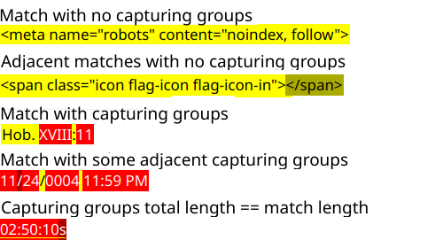

# RegexPy

Yet another playground for testing <ins>Python</ins> flavoured regular expressions.

### Shortcuts and behaviour

Ctrl+O:&emsp;&emsp;&emsp;&emsp;Load sample text 
Ctrl+S:&emsp;&emsp;&emsp;&emsp; Save sample text 
Ctrl+Shift+O:&emsp; Load regex 
Ctrl+Shift+S:&emsp;&ensp;Save regex 

Alt+F/Flag button:&emsp;&emsp;&emsp;Hide/Show regex flag options 
Ctrl + T/Search button:&emsp;Test the regular expression on sample text  
Ctrl+M/Marker button:&emsp;Toggle scrollbar match position markers 
Alt+M/Menu button:&emsp;&emsp; Activate load/save menu 

Hover over matches/groups to identify their indexes.

Alt+Right:&emsp;&emsp;&emsp; Next Match 
Alt+Left:&emsp;&emsp;&emsp;&emsp;Previous Match 
Ctrl+Alt+Right:&emsp;Next Group 
Ctrl+Alt+Left:&emsp;&ensp;&nbsp;Previous Group 
Alt+A:&emsp;&emsp;&emsp;&emsp;&emsp; Return to anchor (after hovering over another match/group) 

Escape or mouse click exit navigation mode.

Tab/Shift+Tab move focus (to enter a tab character use Ctrl+Tab).

Edit the sample [config](./regexpy.conf) file to suit, e.g. highlighting colours.

Last saved regex, last loaded/saved sample and flags are reloaded on restart.

### Highlighting

(Colours can be changed in regexpy.conf but adjacent matches or groups are automatically rendered darker or lighter to suit theme.)

## Dependencies

Python >= 3.7, PySide6, Qt >= 6.4